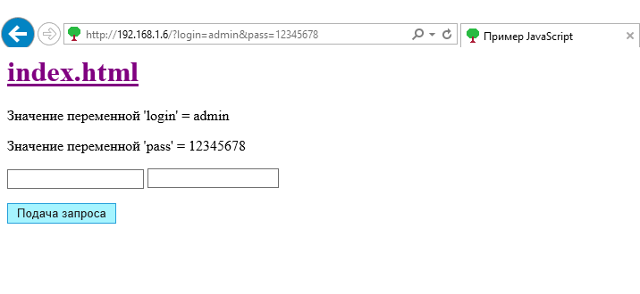

# miniWebServer
Web Server on MicroPython for ESP32
Веб сервер для ESP-32. 
Написан на MicroPython 1.9.4. Код написан в функциональном стиле специально, дабы обеспечить меньше занимаемой памяти в контроллере.

Выводит страницы с каталога "www".
Умеет работать только с Get запросами.

** примеры запуска **
```python
import server2
```


http://micropython.org/download#esp32



